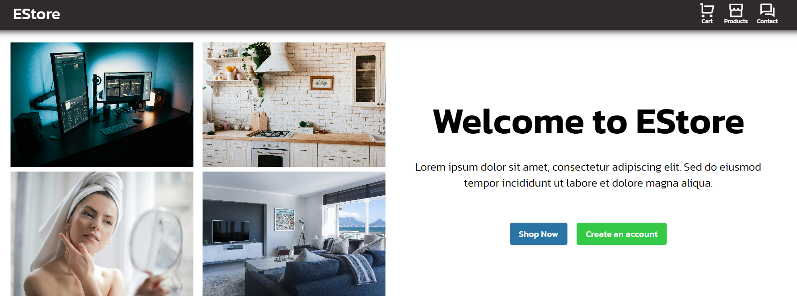

# EStore


## Overview
EStore is an e-commerce web application where visitors can browse products, view detailed information, and add items to their shopping cart. The application is built using React and provides a seamless shopping experience.

## Features
- **Product Browsing:** Users can explore a variety of products, view images, and read detailed descriptions.
- **Shopping Cart:** Visitors can add products to their cart, adjust quantities, and review their selected items.
- **Context API:** The app leverages React's Context API for state management, ensuring that the cart and product details are available across the application.
- **Responsive Design:** The application is fully responsive, providing a smooth user experience on both desktop and mobile devices.

## Installation
To run this project locally, follow these steps:

1. Clone the repository:
    ```bash
    git clone https://github.com/LordBugsy/estore-e-commerce.git
    cd estore
    ```

2. Install the dependencies:
    ```bash
    npm install
    ```

3. Start the development server:
    ```bash
    npm run dev
    ```

## License
This project is licensed under the terms of the [MIT License](./LICENCE.txt). 

You are free to use, modify, and distribute this software for personal or educational purposes. However, selling or claiming ownership of this web app is prohibited.

## Contact
If you encounter any issues while using this web app, please let me know as soon as possible so I can fix them!

- **Twitter/X:** [@mylordbugsy](https://twitter.com/mylordbugsy)

